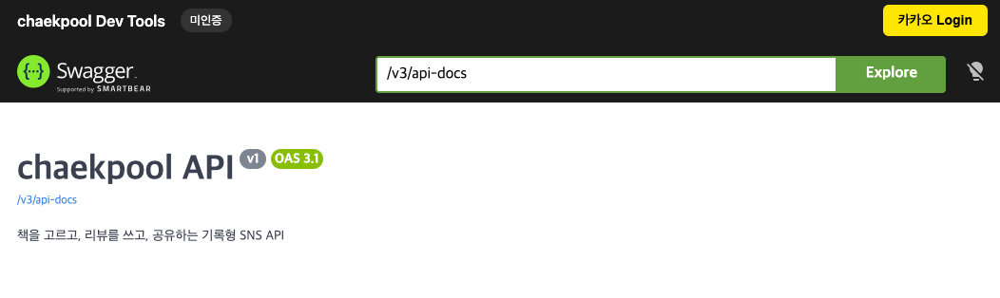
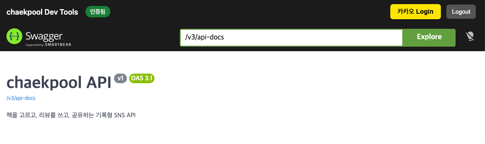
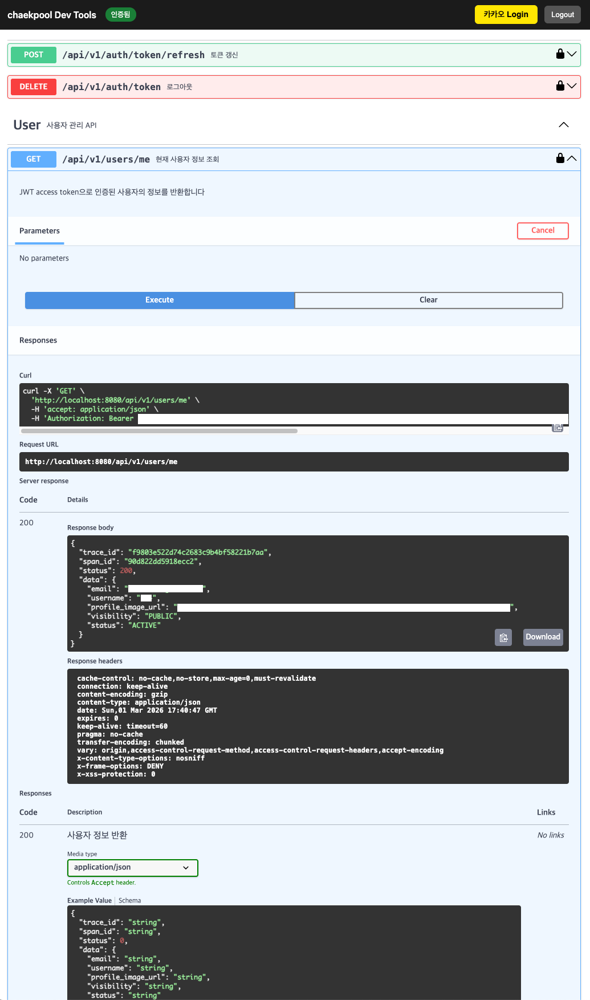

# Swagger UI 사용 가이드

## 시작하기

### Step 1: 서버 실행

```bash
SPRING_PROFILES_ACTIVE=local ./gradlew bootRun
```

- Docker Compose가 자동으로 실행됨 (`spring-boot-docker-compose`)
- 수동 실행: `docker compose -f docker-compose.local.yml up -d`

### Step 2: Swagger OAuth2 UI 접속

브라우저에서 http://localhost:8080/swagger-oauth2-ui/kakao.html 접근

---

## 카카오 로그인으로 API 테스트

### Step 1: 카카오 Login 버튼 클릭



상단 툴바의 **카카오 Login** 버튼 클릭 → 팝업에서 카카오 로그인

### Step 2: 인증 완료 확인



- 로그인 완료 시 팝업 자동 닫힘
- 상태: "미인증" → "인증됨" 변경
- Swagger UI의 `bearerAuth`에 `access_token` 자동 설정

### Step 3: 인증된 API 호출

인증이 필요한 API를 테스트할 수 있습니다:

- `GET /api/v1/users/me` → 200 OK + 사용자 정보 반환
- `DELETE /api/v1/auth/token` → 204 No Content (로그아웃)



### Step 4: 로그아웃

**Logout** 버튼 클릭 → 토큰 제거 + Swagger UI 인증 해제

---

## 기존 Swagger UI

http://localhost:8080/swagger-ui/index.html

수동으로 **Authorize** 버튼에서 토큰 입력 필요

---

## 참고

### 토큰 자동 유지

`persistAuthorization` 설정으로 새로고침 시에도 토큰이 유지됩니다 (localStorage).

### 프로필별 활성화

| 프로필 | Swagger UI | 커스텀 OAuth2 UI |
|--------|-----------|-----------------|
| local  | O         | O               |
| dev    | O         | O               |
| prod   | X         | X               |

### 토큰 만료 시

카카오 Login 재실행 또는 **Token** 태그의 `POST /api/v1/auth/token/refresh` 사용

### 카카오 개발자 콘솔 설정

Redirect URI 등록 필요:

```
http://localhost:8080/api/v1/auth/swagger/oauth2/kakao/callback
```

### 데이터 초기화

```bash
docker compose -f docker-compose.local.yml down -v
```
